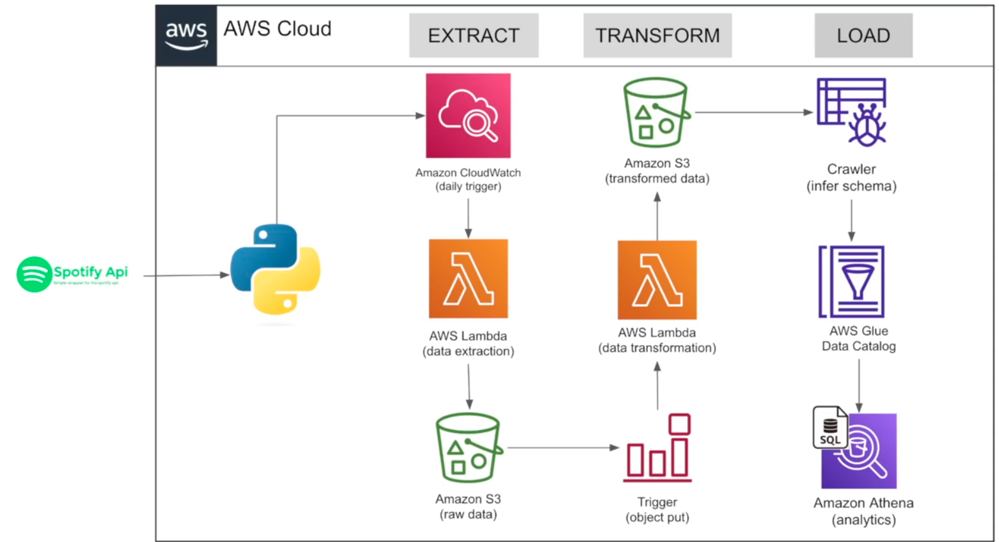

## 📌 Introduction

This project simulates a real-world, cloud-native data engineering workflow using serverless AWS services. It extracts popular song and artist data from the Spotify API, stores it in Amazon S3, transforms it into structured datasets using Python (Pandas), and enables querying via Amazon Athena. The entire pipeline is automated using AWS CloudWatch and S3 triggers.

---

## 🧱 Architecture Overview

The pipeline is fully automated and event-driven:

1. **Daily Trigger (CloudWatch)**: Starts the extract Lambda
2. **Lambda (Extract)**: Fetches Spotify playlist data via API and stores it in raw JSON format in S3
3. **S3 Trigger**: New file in `raw-data/files-to-be-processed/` triggers the transform Lambda
4. **Lambda (Transform)**: Parses JSON, extracts and cleans song/artist data, outputs to S3 as CSV
5. **Glue Crawlers**: Update metadata and schema in the AWS Glue Data Catalog
6. **Athena**: Queries `songs_data` and `artists_data` tables using SQL

---

## 🖼️ Architecture Diagram



---

## 🔁 Data Flow

```text
Spotify API
    ↓
[Lambda: Extract]
    ↓
S3 (Raw Data - JSON)
    ↓ (Trigger)
[Lambda: Transform]
    ↓
S3 (Processed CSVs)
    ↓
AWS Glue Crawlers
    ↓
Athena Tables (songs_data, artists_data)
    ↓
SQL Queries / Analytics
```

---

## 🧰 Tech Stack

|  Component        | Tool/Service             |
|-------------------|--------------------------|
| ETL Scripting     | Python, Pandas           |
| Data Ingestion    | AWS Lambda + Spotify API |
| Storage           | Amazon S3                |
| Data Catalog      | AWS Glue Crawlers        |
| Query Engine      | Amazon Athena            |
| Automation        | CloudWatch, S3 Events    |

---

## 🚀 How to Run or Recreate

> You’ll need an AWS account and a Spotify Developer app with API credentials.

### 🧪 Setup Steps

1. **Create a Spotify Developer App**
   - Go to [Spotify Developer Dashboard](https://developer.spotify.com/dashboard)
   - Create a new app
   - Note down your `client_id` and `client_secret`

2. **Set Up Amazon S3**
   - Create a bucket named: `spotify-etl-project`
   - Create these folders (prefixes):
     - `raw-data/files-to-be-processed/`
     - `raw-data/files-processed/`
     - `transformed-data/songs-data/`
     - `transformed-data/artists-data/`
     - `logs-data/`

3. **Create AWS Lambda Functions**

#### 🟢 Extract Lambda
   - Use `lambda/extract.py`
   - Set environment variables:
     - `client_id` → your Spotify client ID
     - `client_secret` → your Spotify client secret
   - Permissions: Add policy for `s3:PutObject` on your bucket
   - Trigger: Create a **CloudWatch Event Rule** (daily cron job)

#### 🟡 Transform Lambda
   - Use `lambda/transform.py`
   - Permissions: Add policy for:
     - `s3:GetObject`, `s3:PutObject`, `s3:DeleteObject`, `s3:ListBucket`
   - Trigger: **S3 Event Notification**
     - Event type: `PUT`
     - Prefix: `raw-data/files-to-be-processed/`

4. **Set Up AWS Glue Crawlers**
   - Create two crawlers:
     - **Songs Crawler**
       - S3 target: `transformed-data/songs-data/`
       - Output table: `songs_data` in database `spotify_db`
     - **Artists Crawler**
       - S3 target: `transformed-data/artists-data/`
       - Output table: `artists_data` in database `spotify_db`

5. **Query with Amazon Athena**
   - Go to [Athena Console](https://console.aws.amazon.com/athena/)
   - Set your workgroup and output location (e.g., `s3://spotify-etl-project-ubaid/query-results/`)
   - Run SQL queries on:
     - Database: `spotify_db`
     - Tables: `songs_data`, `artists_data`
---

## 🧪 Sample SQL Queries

```sql
--Get top 10 most popular songs
SELECT song_name, popularity, artist_name
FROM songs_data
ORDER BY popularity DESC
LIMIT 10;

-- Count of songs per artist
SELECT artist_name, COUNT(*) AS song_count
FROM songs_data
GROUP BY artist_name
ORDER BY song_count DESC;

-- Songs released after 2020
SELECT song_name, release_date
FROM songs_data
WHERE release_date >= '2020-01-01'
ORDER BY release_date DESC;

--Find artist details by name
SELECT *
FROM artists_data
WHERE artist_name ILIKE '%weeknd%';


